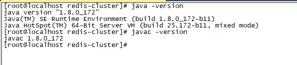

## Centos7安装jdk

以jdk-8u172-linux-x64.tar为例。

步骤：

​	（1）、安装jdk之前，需要检查系统中是否安装了Oracle的jdk，如果有，请删除:


```
rpm -qa | grep java

yum -y remove java-1.8.0-openjdk-headless-1.8.0.131-11.b12.el7.x86_64
yum -y remove javapackages-tools-3.4.1-11.el7.noarch
yum -y remove tzdata-java-2017b-1.el7.noarch
yum -y remove ...
yum -y remove ...
yum -y remove ...
```

​	（2）、下载jdk-8u172-linux-x64.tar，并上传至/usr/local/java目录下（如果没有，新建）：

​	（3）、解压：

```
tar -xvf jdk-8u172-linux-x64.tar
```

​	（4）、编辑/etc/profile文件，vi /etc/profile：

```
export JAVA_HOME=/usr/local/java/jdk1.8.0_172
export PATH=$PATH:$JAVA_HOME/bin
export CLASSPATH=.:$JAVA_HOME/lib/dt.jar:$JAVA_HOME/lib/tools.jar
```

​	（5）、重新加载**/etc/profile**，使其生效：

```
source /etc/profile
```

​	（6）、输入**javac -verion**和**java -version**命令，出现如下图示，则表示jdk安装成功。


