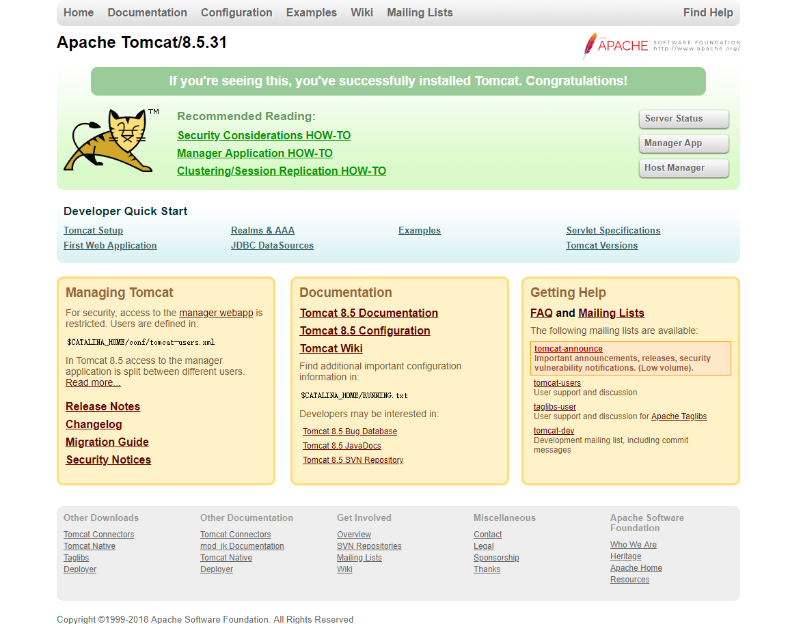

## Centos7安装Tomcat

以apache-tomcat-8.5.31.tar.gz为例。

步骤：

​	（1）、下载apache-tomcat-8.5.31.tar.gz，并上传至/usr/local/tomcat目录下（如果没有，新建）：

​	（2）、解压：

```
tar -zxfv apache-tomcat-8.5.31.tar.gz
```

​	（3）、可以修改文件夹名（也可以不修改，使用默认）：

```
mv apache-tomcat-8.5.31 tomcat8
```

​	（4）、永久开放防火墙8080端口：

```
firewall-cmd --zone=public --add-port=8080/tcp --permanent
```

​	（5）、重启防火墙：

```
firewall-cmd --reload
```

​	（6）、启动/关闭Tomcat

```
./startup.sh
./shutdown.sh
```


​	（7）、外部浏览器访问[http://ip:8080/](http://ip:8080/)，出现如下图示，表示tomcat安装成功。



​	（8）、如果在启动Tomcat的时候，出现未找到JAVA_HOME和JRE_HOME的报错信息：

```
Neither the JAVA_HOME nor the JRE_HOME environment variable is defined
At least one of these environment variable is needed to run this program
```

​	则需要在catalina.sh或者setclasspath.sh文件头前面加入:

```
export JAVA_HOME=/usr/local/java/jdk1.8.0_172
export JRE_HOME=/usr/local/java/jdk1.8.0_172/jre
```

​	（9）、启动Tomcat出现第7步即表示安装成功。
