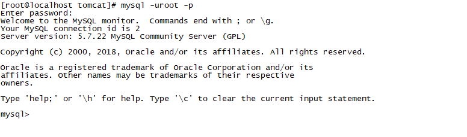

## Centos7安装mysql5.7

步骤：

​	（1）、下载mysql5.7：

```
wget -i -c http://dev.mysql.com/get/mysql57-community-release-el7-10.noarch.rpm
```

​	（2）、安装：

```
yum -y install mysql57-community-release-el7-10.noarch.rpm
```

​	（3）、安装MySQL服务器：

```
yum -y install mysql-community-server
```

​	（4）、启动mysql：

```
systemctl start mysqld
```

​	（5）、获取临时密码：

```
grep "password" /var/log/mysqld.log
```

​	（6）、登录mysql：

```
mysql -uroot -p

输入临时密码, 然后enter回车
```

​	（7）、修改临时密码：

```
alter user 'root'@'localhost' identified by 'newpassword'; 		修改的密码要尽可能复杂
```

​	（8）、开放3306端口

```
firewall-cmd --zone=public --add-port=3306/tcp --permanent
```

​	（9）、允许远程连接

```
grant all privileges on *.* to 'root'@'%' identified by "password" with grant option;
密码是root的密码（可以使用其他用户，则root也要修改对应的用户名）
```

​	（10）、重新加载：

```
flush privileges;
```

​	（11）、如果密码忘记：

```
vi /etc/my.cnf  

添加skip-grant-tables，保存退出vim

systemctl restart mysqld	重启mysql

mysql -uroot 		免密登录

USE mysql;

UPDATE user SET authentication_string = password('新密码') WHERE user = 'root'; 

flush privileges;

将/etc/my.cnf中的skip-grant-tables删除

systemctl restart mysqld	重启mysql

mysql -uroot -p

输入新密码
```

​	（12）、输入新密码，出现如图所示，则表示mysql安装成功：


