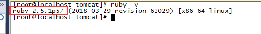

## Centos7安装Ruby

以ruby-2.5.1为例。

步骤：

​	（1）、下载ruby-2.5.1.tar.gz压缩包，并上传至/usr/local/ruby目录下（如果没有，新建）：

​	（2）、解压

```
tar -zxfv ruby-2.5.1.tar.gz
```

​	（3）、进入到ruby文件夹内，进行编译安装

```
cd ruby-2.5.1
./configure 
make && make install
```

​	（4）、输入ruby -v命令，出现如图所示，则表示ruby安装成功：



**问题集：**

​	（1）、安装zlib依赖

```
#安装 zlib和zlib-devel
yum install zlib, zlib-devel

#到ext的zlib目录下
cd /usr/local/ruby/ruby-2.5.1/ext/zlib

#配置环境
ruby extconf.rb

#编译并安装，生成Makefile文件
make && make install

#修改Makefile文件
vim Makefile

#修改zlib.o路径（大概在280行）
zlib.o: $(top_srcdir)/include/ruby.h 改成：zlib.o: ../../include/ruby.h

make && make install
```

​	（2）、Unable to require openssl, install OpenSSL and rebuild ruby (preferred) or use non-HTTPS sources：

```
#-add 添加一个源
#--remove 删除一个源
gem sources --add http://gems.ruby-china.org/  --remove https://rubygems.org/
```