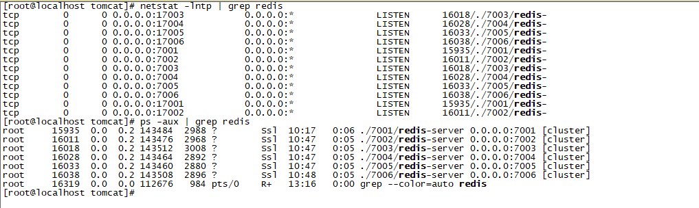

## Centos7安装Redis6

以Redis-6.0.8为例。

### Redis单机版

步骤：

​	（1）、下载Linux版的redis：

```
wget http://download.redis.io/releases/redis-6.0.8.tar.gz
```

​	（2）、解压

```
tar xzf redis-6.0.8.tar.gz
```

​	（3）、进入redis目录，进行编译

```
make MALLOC=libc
```

​	（4）、make 命令遇到如下错误或者编译过程中出现错误:表示c的编译环境不可用或gcc版本太低,需要安装高版本的gcc(redis6.x需要高版本的gcc)，则需要

```
yum -y install centos-release-scl
yum -y install devtoolset-9-gcc devtoolset-9-gcc-c++ devtoolset-9-binutils
source /opt/rh/devtoolset-9/enable

# 长期使用gcc高版本
echo "source /opt/rh/devtoolset-9/enable" >>/etc/profile
```

编译后可以得到服务端和客户端的可执行文件，但是这些文件就位于源码目录中,不方便使用，所以我们可以使用install命令将可执行文件安装至指定的目录下：

```
# 编译安装到指定目录下
make install PREFIX=/usr/local/redis/redis-6.0.8
```

​	（5）、卸载

```
make uninstall
```

​	（6）、远程连接，修改redis.conf配置文件

```
1、打开requirepass前的注释
requirepass 密码

2、protected-mode设置为no
protected-mode no

3、daemonize设置为yes
daemonize yes

4、bind绑定ip
bind 0.0.0.0
```

​	

### Redis集群

步骤：

​	（1）、创建一个集群文件夹redis-cluster，并在目录内新建6个文件夹，分别为7001~7006，用来表示每个redis端口号：

```
mkdir redis-cluster
cd redis-cluster
mkdir 700{1,2,3,4,5,6}
```

（2）、从redis的src文件夹内拷贝redis-server和redis.conf到7001文件夹中，以7001为例：

```
cp redis.conf redis-server 7001/		#注意路径
```

（3）、修改redis.conf配置：

```
1）daemonize yes

2）port 7001（分别对每个机器的端口号进行设置）

3）dir /usr/local/redis/redis-cluster/7001/（指定数据文件存放位置，必须要指定不同的目录位置，不然会丢失数据）

4）cluster-enabled yes（启动集群模式）

5）cluster-config-file /usr/local/redis/redis-cluster/7001/redis.conf（集群节点信息文件，这里700x最好和port对应上）

6）cluster-node-timeout 5000

bind 127.0.0.1（去掉bind绑定访问ip信息）

protected-mode no （关闭保护模式）

9）appendonly yes

如果要设置密码需要增加如下配置：
10）requirepass xxx (设置redis访问密码)

11）masterauth xxx (设置集群节点间访问密码，跟上面一致)
```

​	（4）、依次重复第2步和第3步，拷贝和修改redis.conf文件到7002~7006目录内，修改第2、3、5项里的端口号，可以用批量替换：

```
:%s/7001/7002/g
```

​     （5）、依次启动redis-server

```
./7001/redis-server ./7001/redis.conf
./7002/redis-server ./7002/redis.conf
./7003/redis-server ./7003/redis.conf
./7004/redis-server ./7004/redis.conf
./7005/redis-server ./7005/redis.conf
./7006/redis-server ./7006/redis.conf
```

​	（6）、	使用**netstat -lntp | grep redis** 或者**ps -aux | grep redis**，出现如下图，说明6个redis启动成功。


