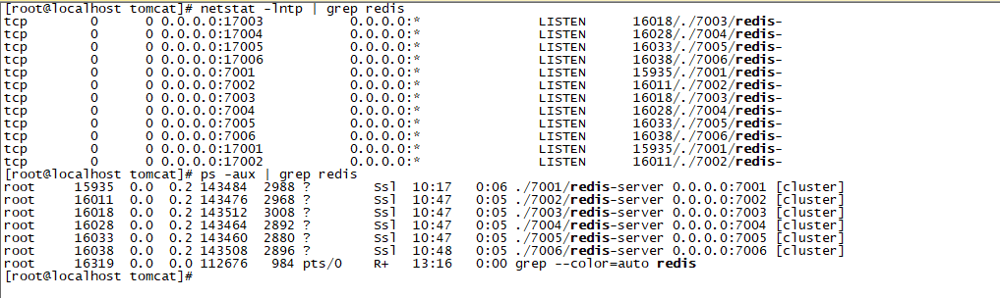

## Centos7安装Redis

以Redis-4.0.9为例。

### 1、单机版

步骤：

​	（1）、下载Linux版的redis：

```
wget http://download.redis.io/releases/redis-4.0.9.tar.gz
```

​	（2）、解压

```
tar xzf redis-4.0.9.tar.gz
```

​	（3）、如果出现jemalloc/jemalloc.h：没有那个文件或目录（需要安装gcc：yum -y install gcc）

```
yum -y install gcc g++ gcc-c++
make MALLOC=libc			注意大小写
```

​	（4）、如果出现：

```
cc: ../deps/hiredis/libhiredis.a: 没有那个文件或目录
cc: ../deps/lua/src/liblua.a: 没有那个文件或目录
cc: ../deps/jemalloc/lib/libjemalloc.a: 没有那个文件或目录
```

则需要

```
cd redis/deps/
make hiredis lua jemalloc
cd ..
make
```

​	（5）、允许远程连接Redis

```
cd redis
vi redis.conf

将bind 127.0.0.1注释或者改成bind 0.0.0.0
将protected-mode=yes设为no
```

​	（6）、进入src目录，启动Redis，指定redis.confg，不然修改的配置无效

```
./src/redis-server ./redis.conf
```

​	（7）、使用redis-cli连接redis服务。

```
./redis-cli					//默认连接本地的redis-server
./redis-cli -h ip -p 端口		//指定端口和ip连接redis-server
```


### 2、集群版

步骤：

​	（1）、创建一个集群文件夹redis-cluster，并在目录内新建6个文件夹，分别为7001~7006，用来表示每个redis端口号：

```
mkdir redis-cluster
cd redis-cluster
mkdir 700{1,2,3,4,5,6}
```

​	（2）、从redis的src文件夹内拷贝redis-server和redis.conf到7001文件夹中，以7001为例：

```
cp redis.conf redis-server 7001/		#注意路径
```

​	（3）、修改redis.conf配置：

```
bind 0.0.0.0
port 7001		# 修改：需要指定每个redis的端口号
daemonize yes
appendonly yes
cluster-enabled yes
cluster-config-file nodes-7001.conf		#修改：具体端口号的700x
cluster-node-timeout 15000
```

​	（4）、依次重复第2步和第3步，拷贝和修改redis.conf文件到7002~7006目录内；

​	（5）、依次启动redis-server

```
./7001/redis-server ./7001/redis.conf
./7002/redis-server ./7002/redis.conf
./7003/redis-server ./7003/redis.conf
./7004/redis-server ./7004/redis.conf
./7005/redis-server ./7005/redis.conf
./7006/redis-server ./7006/redis.conf
```

​	（6）、	使用**netstat -lntp | grep redis** 或者**ps -aux | grep redis**，出现如下图，说明6个redis启动成功。



​	（7）、安装Ruby环境，参考<u>6、Centos7安装Ruby</u>

​	（8）、安装Redis和Ruby的接口，通过gem安装

```
gem install redis
```

​	（9）、将redis/src/redis-trib.rb文件拷贝到集群文件夹下，使用如下命令创建redis集群：

```
./redis-trib.rb create --replicas 1 172.20.16.117:7001 172.20.16.117:7002 172.20.16.117:7003 172.20.16.117:7004 172.20.16.117:7005 172.20.16.117:7006
```

​	输入yes，让其自动分配主从分配方式

​	（10）、检查集群完整性

```
./redis-4.0.1/src/redis-trib.rb check 172.16.20.117:7001
./redis-4.0.1/src/redis-trib.rb check 172.16.20.117:7002
./redis-4.0.1/src/redis-trib.rb check 172.16.20.117:7003
./redis-4.0.1/src/redis-trib.rb check 172.16.20.117:7004
./redis-4.0.1/src/redis-trib.rb check 172.16.20.117:7005
./redis-4.0.1/src/redis-trib.rb check 172.16.20.117:7006
```

​	（11）、使用客户端连接集群

```
./redis-cli -c -h 172.20.16.117 -p 7001		#随便使用任意端口号
```

必须要使用-c，表示连接集群，不然连接的只是某个redis-server。