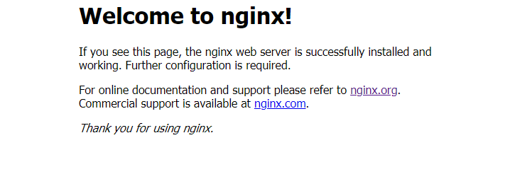

## Centos7安装Nginx

以Nginx-1.14.0为例：

步骤：

​	（1）、下载nginx-1.14.0压缩包

```
wget http://nginx.org/download/nginx-1.14.0.tar.gz

或者从官网下载ngix-1.14.0压缩包，并上传至服务器
```

​	（2）、解压

```
tar -zxvf nginx-1.14.0.tar.gz
```

​	（3）、安装依赖

```
yum -y install pcre pcre-devel openssl openssl-devel
```

​	（4）、使用默认配置，编译，安装

```
./configure --prefix=/usr/local/nginx
make && make install
```

​	（5）、进入/usr/local/nginx目录，启动nginx

```
./sbin/nginx
```

​	（6）、外部浏览器访问http://172.20.16.133	，默认端口号为80，可以不写，（前提是开放了80端口），如果出现如图所示，则表示nginx安装成功。


