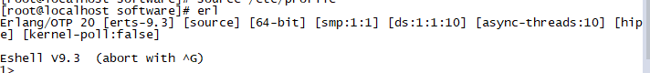

## Centos7安装Erlang

​	1）、先从Erlang官网下载源码包或者在线下载源码包

```
wget http://www.erlang.org/download/otp_src_20.3.tar.gz
```

​	2）、安装依赖

```
yum -y install gcc glibc-devel make ncurses-devel openssl-devel xmlto perl wget
```

​	3）、解压

```
tar -xzvf otp_src_20.3.tar.gz  //解压
```

​	4）、切换目录

```
cd otp_src_20.3
```

​	5）、生产环境安装

```
./configure --prefix=/usr/local/erlang
```

​	6）、编译安装

```
make && make install
```

​	7）、配置环境变量，/etc/profile

```
export ERL_HOME=/usr/local/erlang
export PATH=$ERL_HOME/bin:$PATH
```

​	8）、配置生效

```
source /etc/profile
```

​	9）、如果出现如下图，说明erlang安装成功了

