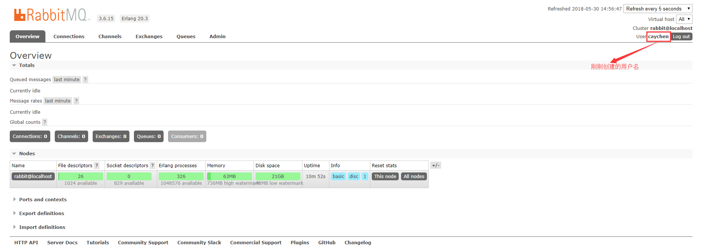

## 13、Centos7安装RabbitMQ

安装RabbitMQ的前提是先要把Erlang安装成功。见上一节安装Erlang。

​	1）、进入安装目录并下载RabbitMQ

```
wget http://www.rabbitmq.com/releases/rabbitmq-server/v3.6.15/rabbitmq-server-generic-unix-3.6.15.tar.xz
```

​	2）、解压

```
xz -d rabbitmq-server-generic-unix-3.6.15.tar.xz
tar -xvf rabbitmq-server-generic-unix-3.6.15.tar
```

​	3）、配置环境变量，/etc/profile

```
export RABBIT_HOME=/usr/local/rabbitmq/rabbitmq_server-3.6.15
exoprt PATH=$PATH:$RABBIT_HOME/sbin
```

​	4）、配置生效

```
source /etc/profile
```

​	5）、永久开放5672/15672端口

```
firewall-cmd --zone=public --add-port=15672/tcp --add-port=5672/tcp --permanent
```

​	6）、防火墙重启

```
firewall-cmd --reload
systemctl restart firewall
```

​	7）、配置网页插件

```
rabbitmq-plugins enable rabbitmq_management
```

​	8）、启动rabbitmq

```
启动服务：rabbitmq-server -detached【 /usr/local/rabbitmq/sbin/rabbitmq-server -detached 】
查看状态：rabbitmqctl status【 /usr/local/rabbitmq/sbin/rabbitmqctl status  】
关闭服务：rabbitmqctl stop【 /usr/local/rabbitmq/sbin/rabbitmqctl stop  】
列出角色：rabbitmqctl list_users
```

​	9）、外部浏览器访问服务器ip:15672，出现如下图说明安装成功


​	10）、默认情况下guest只能在localhost上登录，需要自己设置用户名和密码（用户名和密码自定义）

```
rabbitmqctl add_user '用户名' '密码'		//添加用户，后面两个参数分别是用户名和密码
 rabbitmqctl set_permissions -p / '用户名' ".*" ".*" ".*"	 //添加权限
 rabbitmqctl set_user_tags '用户名' administrator  //修改用户角色
```

​	11）、使用刚刚创建的用户名和密码再次登录，如果出现如下图说明用户创建成功了



