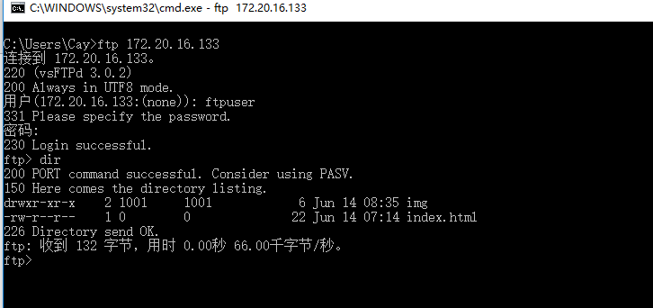
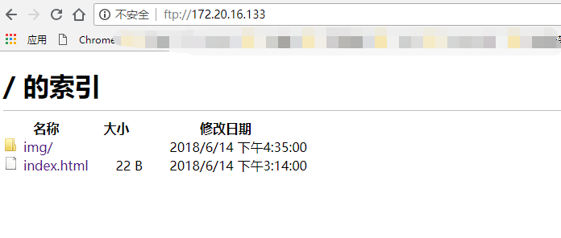

## Centos7安装vsftpd服务

​	1）、查找是否已安装vsftpd服务：

```
rpm -qa vsftpd
```

​	2）、如果有返回结果，则先停止，并卸载vsftpd：

```
systemctl stop vsftpd
yum remove ...
```

​	3）、安装vsftpd组件

```
yum -y install vsftpd
```

​	4）、在/目录下新建文件夹ftpfile用于上传文件

```
cd /
mkdir ftpfile
```

​	5）、进入ftpfile目录，新建ftpuser用户

```
cd ftpfile
useradd ftpuser -d /ftpfile/ -s /sbin/nologin
```

​	6）、赋予文件夹权限

```
chown -R ftpuser.ftpuser /ftpfile/
```

​	7）、修改ftpuser密码

```
passwd ftpuser
```

​	8）、修改vsftpd配置文件

```
vim /etc/vsftpd/vsftpd.conf

修改如下：
####################################################
#anonymous_enable=YES
anonymous_enable=NO
 
local_root=/ftpfile
###################################################
###################################################
#chroot_list_enable=YES
# (default follows)
#chroot_list_file=/etc/vsftpd/chroot_list
chroot_list_enable=YES
chroot_list_file=/etc/vsftpd/chroot_list
###################################################
###################################################
pasv_enable=YES
pasv_min_port=61001
pasv_max_port=62000
####################################################
```

​	9）、新建chroot_list文件

```
touch /etc/vsftpd/chroot_list
```

​	10）、修改selinux安全设置

```
vim /etc/sysconfig/selinux

#####################################################
#SELINUX=enforcing
SELINUX=disabled
#####################################################
```

​	11）、设置生效或者重启

```
setenforce 0
或者
reboot
```

​	12）、开放防火墙端口并重启

```
firewall-cmd --zone=public --add-port=61001-62000/tcp --permanent
firewall-cmd --zone=public --add-port=20-21/tcp --permanent

firewall-cmd --reload
```

​	13）、启动vsftpd服务

```
systemctl start vsftpd
```

​	14）、使用windows的cmd窗口远程登录ftp服务器，如果出现如下即表示安装成功。



​	15）、使用浏览器远程访问ftp服务器，如果出现如下如下图示，则表示能正常登录及访问。

