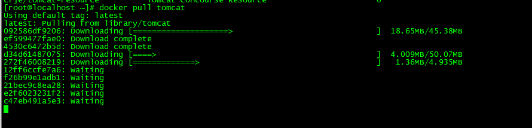
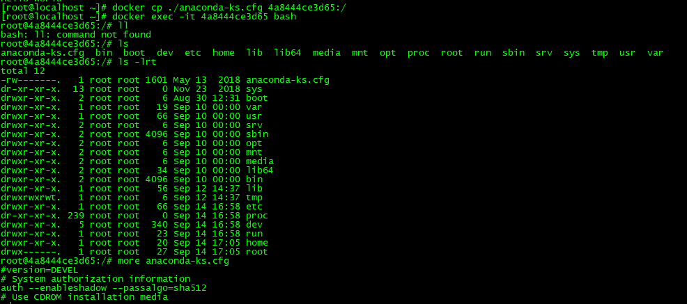

## Docker-CE教程（基于Centos7）

### 1、Docker安装

#### 1.1、卸载旧版本

```
sudo yum remove docker \
                  docker-client \
                  docker-client-latest \
                  docker-common \
                  docker-latest \
                  docker-latest-logrotate \
                  docker-logrotate \
                  docker-engine
```


#### 1.2、安装依赖

```
sudo yum install -y yum-utils \
  device-mapper-persistent-data \
  lvm2
```

```
sudo yum-config-manager \
    --add-repo \
    https://download.docker.com/linux/centos/docker-ce.repo
```

```
sudo yum-config-manager --enable docker-ce-nightly
```

```
sudo yum install docker-ce docker-ce-cli containerd.io
```


#### 1.3、启动Docker

```
sudo systemctl start docker
```


### 2、使用阿里云镜像加速器

#### 2.1、登录阿里云管理控制台


#### 2.2、按照步骤进行配置

```
sudo tee /etc/docker/daemon.json <<-'EOF'
{
  "registry-mirrors": ["https://vew9z43d.mirror.aliyuncs.com"]
}
EOF
sudo systemctl daemon-reload
sudo systemctl restart docker
```


### 3、Hello World


### 4、Docker常用命令

#### 4.1、docker images：列出本机主机上的镜像文件

```
语法：
	docker images [OPTIONS] [REPOSITORY[:TAG]]
```


* 常用选项：

  * -a：列出本机所有的镜像，包括中间映像层

  

  * -q：只显示镜像ID

  

  * --digests：显示镜像的摘要信息

  

  * --no-trunc：显示完整的镜像信息

  


#### 4.2、docker search：查找镜像

```
语法：
	docker search [OPTIONS] TERM
```


* 常用选项：

  * -filter=stars=30：过滤掉stars小于30的镜像，即只显示stars大于或者等于30的镜像

  


#### 4.3、docker pull：拉取镜像

```
语法：
	docker pull [OPTIONS] NAME[:TAG|@DIGEST]
```




#### 4.4、docker rmi：删除镜像

```
语法：
	docker rmi [OPTIONS] IMAGE [IMAGE...]
```

* 删除单个镜像


* 删除多个镜像


* 删除全部镜像


#### 4.5、docker run：启动容器

```
语法：
	docker run [OPTIONS] IMAGE [COMMAND] [ARG...]
```


* 常用选项：

  * --name：指定容器的名字，默认docker会自动创建一个名字作为容器名

  

  

  * -d / --detach：在后台运行容器
  * -i：以交互模式运行容器，通常与-t同时使用
  * -t：为容器重新分配一个伪输入终端，通常与-i同时使用
  * -P：随机端口映射
  * -p：指定端口映射，有以下四种格式
    * ip:hostPort:containerPort
    * ip::containerPort
    * hostPort:containerPort
    * containerPort

​	

#### 4.6、docker ps：列出当前所有正在运行的容器

```
语法：
	docker ps [OPTIONS]
```


* 常用选项：

  * -a：列出所有运行中的容器及之前运行的容器（当前已停止的容器）

  

  * -l：列出上一个容器，包含所有状态的容器

  

  * -n xxx：列出最新的xxx个容器，包含所有状态的容器

  

  * -q：只列出容器的ID

  


#### 4.7、退出容器

* （1）、exit：容器停止退出


* （2）、ctrl+P+Q：容器不停止退出


#### 4.8、docker start：启动容器

```
语法：
	docker start [OPTIONS] CONTAINER [CONTAINER...]
```


#### 4.9、docker stop：停止容器

stop：会安静的慢慢停止容器

```
语法：
	docker stop [OPTIONS] CONTAINER [CONTAINER...]
```


#### 4.10、docker restart：重启容器

```
语法：
	docker restart [OPTIONS] CONTAINER [CONTAINER...]
```


#### 4.11、docker kill：强制停止容器

kill：会直接将容器停止，比stop快

```
语法：
	docker kill [OPTIONS] CONTAINER [CONTAINER...]
```


#### 4.12、docker rm：删除容器

```
语法：
	docker rm [OPTIONS] CONTAINER [CONTAINER...]
```

删除单个容器：


删除多个容器；


强制删除运行中的容器：


#### 4.13、docker inspect：查看容器细节

```
语法：
	docker inspect [OPTIONS] NAME|ID [NAME|ID...]
```


#### 4.14、docker top：查看容器内运行的进程

```
语法：
	docker top CONTAINER [ps OPTIONS]
```


#### 4.15、docker attach/exec：与运行中的容器进行交互

```
attach语法:
	docker attach [OPTIONS] CONTAINER
	
exec语法：
	docker exec [OPTIONS] CONTAINER COMMAND [ARG...]
```


#### 4.16、docker cp：文件拷贝

```
语法：
	docker cp [OPTIONS] CONTAINER:SRC_PATH DEST_PATH|-
    docker cp [OPTIONS] SRC_PATH|- CONTAINER:DEST_PATH
```

从docker容器中往外拷贝


从外往docker容器中拷贝

