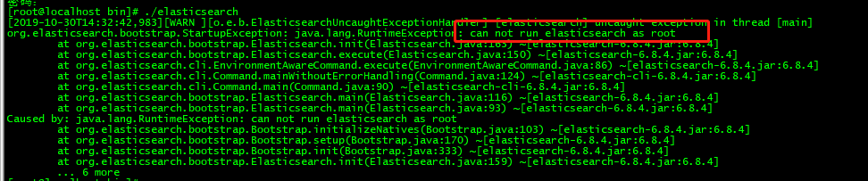
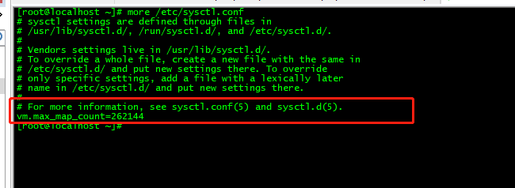
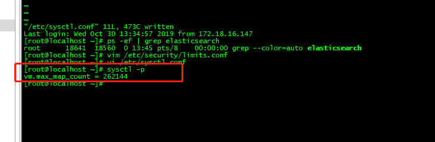
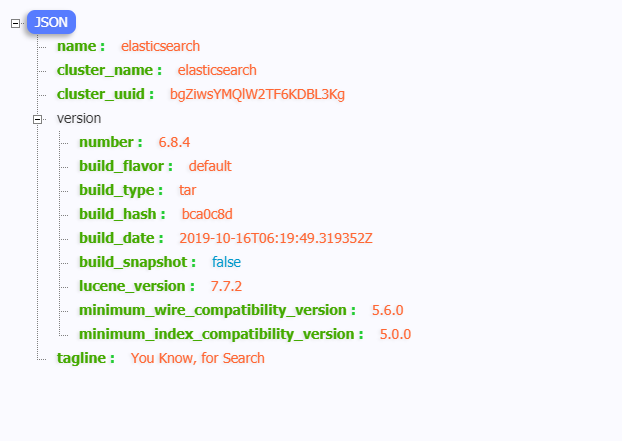

## Centos7安装ElasticSearch

以ElasticSearch-6.8.4为例。

1）、需要下载elasticsearch-6.8.4

```
wget https://artifacts.elastic.co/downloads/elasticsearch/elasticsearch-6.8.4.tar.gz
```

或者官网[https://www.elastic.co/cn/downloads/]( https://www.elastic.co/cn/downloads/ )进行下载并上传。

 2）、解压

```
tar -xzvf elasticsearch-6.8.4.tar.gz
```

3）、在elasticsearch5以上版本， 如果以root身份运行将会出现以下问题，这个错误，是因为使用root用户启动elasticsearch，elasticsearch是不允许使用root用户启动的 ：

```
...
org.elasticsearch.bootstrap.StartupException: java.lang.RuntimeException:can not run elasticsearch as root
...
```



所以建议 一个单独的用户用来运行ElasticSearch。

4）、 创建esgroup用户组及esuser用户 

```
#创建esgroup用户组
groupadd esgroup

#创建esuser用户，用户组为esgroup，密码为123456
useradd esuser -g esgroup -p 123456
```


5）、更改elasticsearch的所属用户及组

```
cd elasticsearch-6.8.4

#将elasticsearch-6.8.4文件夹的所属用户设为esuser，所属组为esgroup
chown -R esuser:esgroup elasticsearch-6.8.4
```

6）、切换用户并启动es

```
#切换用户
su esuser

cd elasticsearch-6.8.4/bin

#启动es
./elasticsearch
```

7）、默认情况下，启动会报错：

```
ERROR: [2] bootstrap checks failed
[1]: max file descriptors [4096] for elasticsearch process is too low, increase to at least [65535]
[2]: max virtual memory areas vm.max_map_count [65530] is too low, increase to at least [262144]
```

对于问题1，最大文件描述符太小，需要增加到最小值65535，解决方案如下：

```
vim /etc/security/limits.conf

在文件最后添加
*** hard nofile 65536
*** soft nofile 65536

wq保存退出
```


对于问题2，是因为max_map_count最大值太小，需要增加到最小值262144，解决方案如下：

```
vi /etc/sysctl.conf

在文件最后添加
vm.max_map_count=262144

wq保存退出
```



执行sysctl -p使其生效：

```
sysctl -p
```



8）、修改elasticsearch.yml配置文件

```
http.cors.enabled: true			
http.cors.allow-origin: "*"		
node.name: "elasticsearch"  	#当前节点名
```


9）、后台启动es

```
cd bin
./elasticsearch -d
```


10）、查看elsticsearch是否正常启动，及端口

```
ps -ef | grep elasticsearch

netstat -anlupt | grep 9200
```


11）、开放9200端口，在浏览器上执行ip:9200

