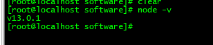
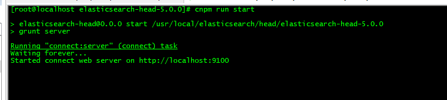
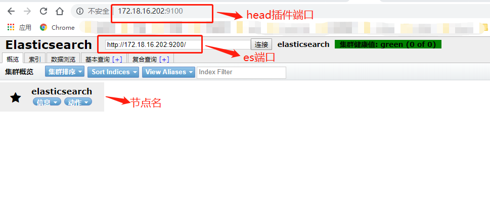

## Centos7安装ElasticSearch-head

1）、下载elasticsearch-head插件

```
wget https://github.com/mobz/elasticsearch-head/archive/v5.0.0.tar.gz
```

2）、解压缩

```
tar -xzvf elasticsearch-head-5.0.0.tar.gz
```

3）、由于启动head插件需要npm，所以需要安装nodejs

首先下载nodejs：

```
wget http://nodejs.org/dist/v13.0.1/node-v13.0.1-linux-x64.tar.gz
```

4）、解压缩nodejs

```
tar -xzvf node-v13.0.1-linux-x64.tar.gz
```

5）、配置node的环境变量

```
vim /etc/profile

在文件最后添加
export NODE_HOME=/usr/local/nodejs/node-v13.0.1-linux-x64
export PATH=$PATH:$NODE_HOME/bin

wq保存退出

重启使其生效
source /etc/profile
```

6）、输入命令node -v会显示安装的node版本



7）、设置npm的镜像为淘宝镜像cnpm

```
npm install -g cnpm --registry=https://registry.npm.taobao.org
```

8）、进入head插件文件夹，依次执行命令

```
cnpm install 

#后台启动
nohup cnpm run start &
```




9）、开放9100端口和9200，使用ip:9100

