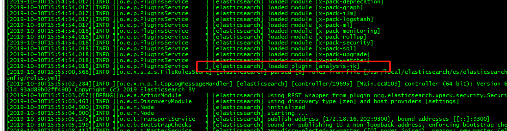

## Centos7安装中文分词器elasticsearch-ik

1）、下载中文分词器压缩包

```
wget https://github.com/medcl/elasticsearch-analysis-ik/releases/download/v6.8.4/elasticsearch-analysis-ik-6.8.4.zip
```

2）、安装zip和unzip

```
yum install -y zip unzip
```

3）、在解压缩后的elasticsearch的plugins目录下新增文件夹ik

```
cd elasticsearch-6.8.4/plugins & mkdir ik
```

4）、解压分词器压缩包到ik文件夹（具体路径具体修改）

```
unzip elasticsearch-analysis-ik-6.8.4.zip -d elasticsearch-6.8.4/plugins/ik
```

5）、重启elasticsearch

```
nohup ./bin/elasticsearch &
```

打开nohup.out文件，会看到一条日志

