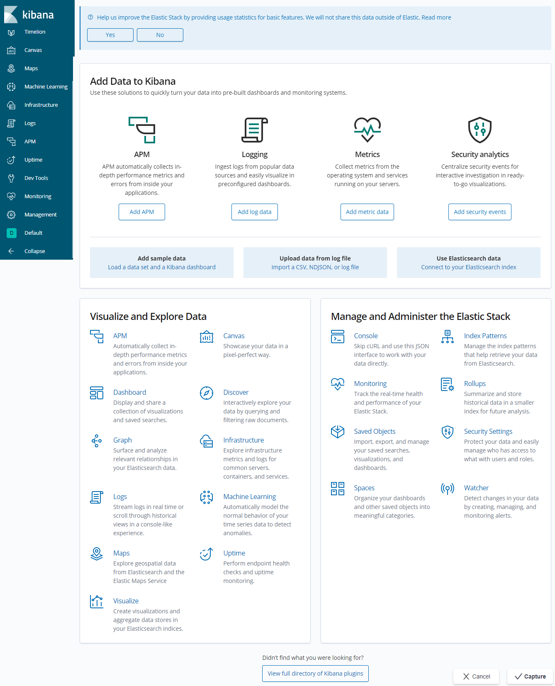

## Centos7安装Kibana

1）、下载kibana压缩包

```
wget https://artifacts.elastic.co/downloads/kibana/kibana-6.8.4-linux-x86_64.tar.gz
```

2）、解压缩

```
tar -xzvf kibana-6.8.4-linux-x86_64.tar.gz
```

3）、修改kibana配置文件，满足最基本的配置即可

```
cd kibana-6.8.4-linux-x86_64.tar.gz/config/
vim kibana.yml
```

```
server.host: "0.0.0.0"
elasticsearch.hosts: ["http://localhost:9200"]
```

4）、启动kibana

```
nohup ./bin/kibana &
```

5）、kibana默认端口为5601，如果需要外部远程访问，则需要开放5601端口

```
firewall-cmd --zone=public --add-port=5601/tcp --permanent
firewall-cmd --reload
```

6）、浏览器输入ip:5601，如果出现如下页面，则表示kibana启动成功

